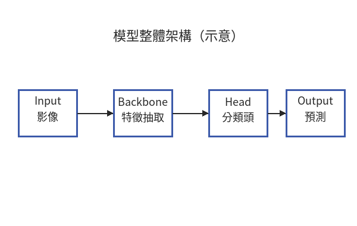

<!--
封面頁：每個元素之間「必須」空一行。
若把 \vspace 與文字區塊黏在一起（中間不空行），pandoc 會把整段併成
一個橫向段落，所有 \vspace 在水平模式下失效 → 封面全擠在一起。
-->
\begin{titlepage}
\begin{center}

\vspace*{1cm}

{\fontsize{24pt}{28pt}\selectfont\bfseries \Spaced[1em]{\UniversityZh}}

\vspace{2cm}

{\fontsize{18pt}{24pt}\selectfont \Spaced[0.5em]{\Department}}

\vspace{0.3cm}

{\fontsize{18pt}{24pt}\selectfont \Spaced[0.5em]{\Program}}

\vspace{0.3cm}

{\fontsize{18pt}{24pt}\selectfont \Spaced[0.5em]{\Degree}}

\vspace{2.5cm}

{\fontsize{18pt}{24pt}\selectfont\bfseries \ThesisTitleZh}

\vspace{0.5cm}

{\fontsize{14pt}{18pt}\selectfont \ThesisTitleEn}

\vspace{4cm}

{\fontsize{14pt}{18pt}\selectfont \Spaced[0.3em]{研究生：}\StudentName}

\vspace{0.3cm}

{\fontsize{14pt}{18pt}\selectfont \Spaced[0.3em]{指導教授：}\AdvisorName}

\vspace{2cm}

{\fontsize{14pt}{18pt}\selectfont \Spaced[0.3em]{中華民國\ROCYear 年\ROCMonth 月}}

\end{center}
\end{titlepage}

<!-- 摘要 -->
\pagenumbering{roman}
\pagestyle{frontmatter}

\begin{center}
{\Large\bfseries 摘要}
\end{center}

本論文展示 PaperForge 工作流可支援的完整論文元素，涵蓋前置部分（摘要、目錄、圖目錄、表目錄）、正文章節、單張圖與子圖排版、一般表格與 multirow 跨列表格、單行與多行對齊公式、腳註、跨章節引用，以及 IEEE 格式參考文獻。本範例可作為新使用者建立自己論文骨架的參考；所有圖檔皆為合成示意圖，並非真實實驗數據。

\vspace{0.5cm}

\noindent\textbf{關鍵字：Pandoc、Markdown、學位論文、學術寫作工作流、NCU}

\newpage

\begin{center}
{\Large\bfseries Abstract}
\end{center}

This thesis demonstrates the full set of features supported by the PaperForge workflow, including front matter (abstract, table of contents, list of figures, list of tables), main chapters, single and sub-figure layouts, plain and multirow tables, single-line and aligned multi-line equations, footnotes, cross-references, and IEEE-style references. This example serves as a reference for new users building their own thesis skeleton; all figures are synthetic illustrations rather than real experimental data.

\vspace{0.5cm}

\noindent\textbf{Keywords: Pandoc, Markdown, Thesis, Academic Writing, NCU}

\newpage

<!-- 目錄、圖目錄、表目錄 -->
\tableofcontents
\newpage

\listoffigures
\newpage

\listoftables
\newpage

<!-- 正文 -->
\pagenumbering{arabic}
\pagestyle{mainmatter}

# 緒論 {#sec:intro}

## 研究背景 {#sec:intro-background}

深度學習在影像辨識領域取得突破性進展。自 Krizhevsky 等人[@krizhevsky2012imagenet]提出 AlexNet 以來，卷積神經網路（Convolutional Neural Network, CNN）成為主流方法。He 等人[@he2016resnet]進一步提出殘差學習（Residual Learning），解決深層網路訓練的退化問題。^[殘差學習的核心是跳接連結（skip connection），讓梯度可直接回傳至淺層，緩解深層網路的梯度消失問題。此處以腳註示範 PaperForge 對腳註的支援。]

近期，Vaswani 等人[@vaswani2017attention]提出 Transformer 架構，後續 Dosovitskiy 等人[@dosovitskiy2020vit]將其延伸至影像領域，催生了視覺 Transformer（Vision Transformer, ViT）的研究熱潮。

## 研究動機 {#sec:intro-motivation}

不同架構在性能與效率上各有取捨。本研究系統比較數種代表性架構，協助實務工作者根據需求選擇合適模型。

## 論文架構 {#sec:intro-structure}

本論文共五章。\ref{sec:literature} 章回顧相關文獻；\ref{sec:method} 章說明研究方法；\ref{sec:results} 章呈現實驗結果；\ref{sec:conclusion} 章總結並提出未來方向。

# 文獻探討 {#sec:literature}

## CNN 家族 {#sec:literature-cnn}

CNN 的雛形可追溯至 LeCun 等人[@lecun1998gradient]提出的 LeNet，透過捲積運算提取局部特徵，並以池化操作降低空間維度。其後 ResNet[@he2016resnet] 引入跳接連結（skip connection），使得網路可有效訓練至超過 100 層。

## Transformer 家族 {#sec:literature-transformer}

Transformer 最初應用於自然語言處理[@vaswani2017attention]，其核心為自注意力機制（self-attention）。ViT[@dosovitskiy2020vit] 將影像切割為 patches，視為序列輸入 Transformer。

## 混合架構 {#sec:literature-hybrid}

Swin Transformer[@liu2021swin] 結合 CNN 的層級結構與 Transformer 的注意力機制，在多項視覺任務上取得最佳表現。

# 研究方法 {#sec:method}

## 整體架構 {#sec:method-overview}

本研究比較三類模型架構：CNN、Transformer、與混合架構。整體流程如圖 \ref{fig:architecture} 所示，輸入影像先經 Backbone 抽取特徵，再由分類頭輸出預測類別。

{#fig:architecture width=70%}

所有模型均以 ImageNet-1k 預訓練權重初始化，並在目標資料集上微調。

## 訓練配置 {#sec:method-training}

訓練超參數設定如表 \ref{tab:hyperparameters} 所示；各架構的參數量與正確率比較則整理於表 \ref{tab:comparison}。

\begin{table}[htbp]
\centering
\caption{訓練超參數設定}
\label{tab:hyperparameters}
\small
\begin{tabular}{lp{6cm}}
\hline
\textbf{超參數} & \textbf{值} \\
\hline
最佳化器 (Optimizer) & AdamW \\
學習率 (Learning Rate) & $1 \times 10^{-4}$ \\
權重衰減 (Weight Decay) & $1 \times 10^{-2}$ \\
批次大小 (Batch Size) & 32 \\
訓練週期 (Epochs) & 100 \\
資料增強 (Augmentation) & RandAugment + MixUp \\
\hline
\end{tabular}
\end{table}

\begin{table}[htbp]
\centering
\caption{各架構參數量與正確率比較（示意數據）}
\label{tab:comparison}
\small
\begin{tabular}{llrr}
\hline
\textbf{類別} & \textbf{模型} & \textbf{參數量 (M)} & \textbf{正確率 (\%)} \\
\hline
\multirow{2}{*}{CNN} & ResNet-50  & 25.6  & 92.1 \\
                     & ResNet-101 & 44.5  & 93.0 \\
\hline
\multirow{2}{*}{Transformer} & ViT-B/16 & 86.6  & 93.8 \\
                             & ViT-L/16 & 304.0 & 94.2 \\
\hline
混合 & Swin-B & 87.8 & 94.5 \\
\hline
\end{tabular}
\end{table}

## 評估指標 {#sec:method-metrics}

主要指標為分類正確率，定義為：

\begin{equation}
\text{Accuracy} = \frac{\text{Correct Predictions}}{\text{Total Samples}}
\label{eq:accuracy}
\end{equation}

為更細緻評估各類別表現，另採用精確率、召回率與 $F_1$ 分數，其定義以多行對齊公式列出：

\begin{align}
\text{Precision} &= \frac{TP}{TP + FP} \label{eq:precision} \\
\text{Recall}    &= \frac{TP}{TP + FN} \label{eq:recall} \\
F_1 &= 2 \cdot \frac{\text{Precision} \cdot \text{Recall}}{\text{Precision} + \text{Recall}} \label{eq:f1}
\end{align}

公式 \ref{eq:accuracy} 為整體正確率；公式 \ref{eq:precision} 至 \ref{eq:f1} 為各類別細部指標。

# 實驗結果與討論 {#sec:results}

## 主要結果 {#sec:results-main}

實驗共評估 `\experimentTotal`{=latex} 筆樣本，其中 `\experimentCorrect`{=latex} 筆預測正確，整體正確率為 `\experimentAccuracy`{=latex}\%。訓練過程的損失與正確率變化如圖 \ref{fig:curves} 所示，其中子圖 \ref{fig:loss} 為訓練損失、子圖 \ref{fig:acc} 為驗證正確率。

\begin{figure}[!htbp]
\centering
\begin{subfigure}[b]{0.48\textwidth}
\centering
\includegraphics[width=\textwidth]{images/loss_curve.png}
\caption{訓練損失}
\label{fig:loss}
\end{subfigure}
\hfill
\begin{subfigure}[b]{0.48\textwidth}
\centering
\includegraphics[width=\textwidth]{images/accuracy_curve.png}
\caption{驗證正確率}
\label{fig:acc}
\end{subfigure}
\caption{訓練過程曲線（示意）}
\label{fig:curves}
\end{figure}

## 討論 {#sec:results-discussion}

實驗結果顯示，混合架構在效能與效率之間達到較佳平衡。CNN 架構訓練速度快但效能略低；Transformer 架構效能高但需要較大資料量。由表 \ref{tab:comparison} 可見，參數量的增加並未線性反映在正確率上，顯示架構設計比單純堆疊參數更為關鍵。

# 結論 {#sec:conclusion}

## 結論 {#sec:conclusion-summary}

本論文系統比較三類深度學習架構，並展示 PaperForge 工作流可完整支援論文常見元素：章節編號、跨章節引用、圖目錄與表目錄、單張圖與子圖、一般表格與 multirow 表格、單行與多行公式、腳註、以及自動參考文獻。

## 未來工作 {#sec:conclusion-future}

未來可進一步探討多模態架構，以及在資源受限環境下的模型壓縮技術。

<!-- 參考文獻 -->
\newpage
\printbibliography[title=參考文獻]
